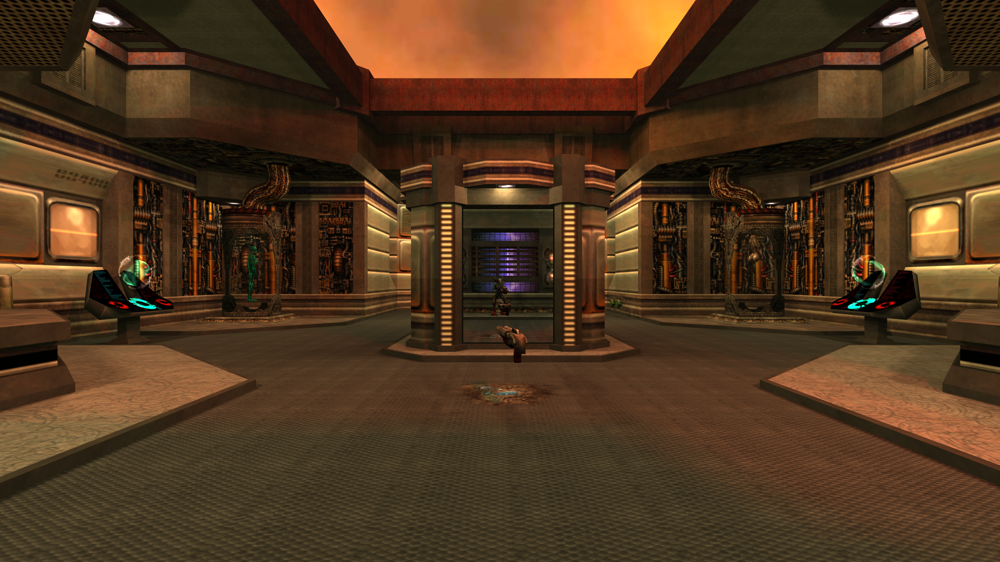
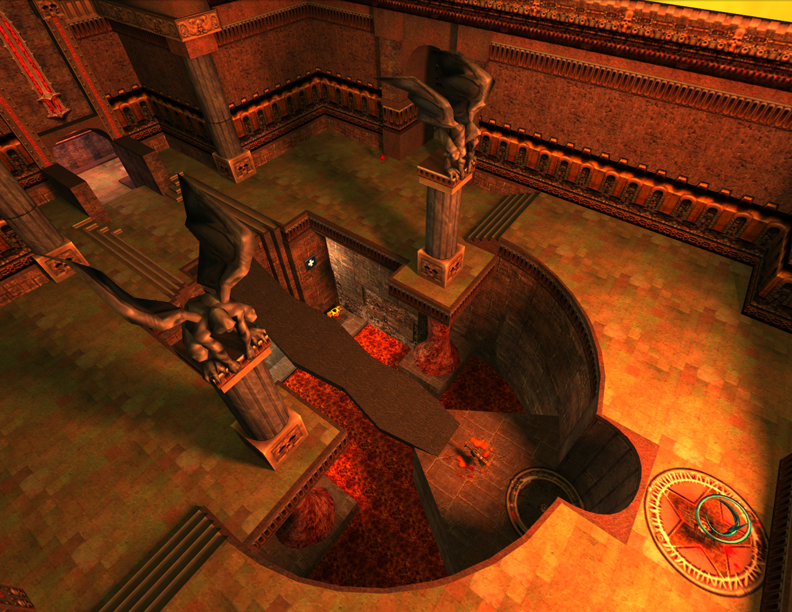
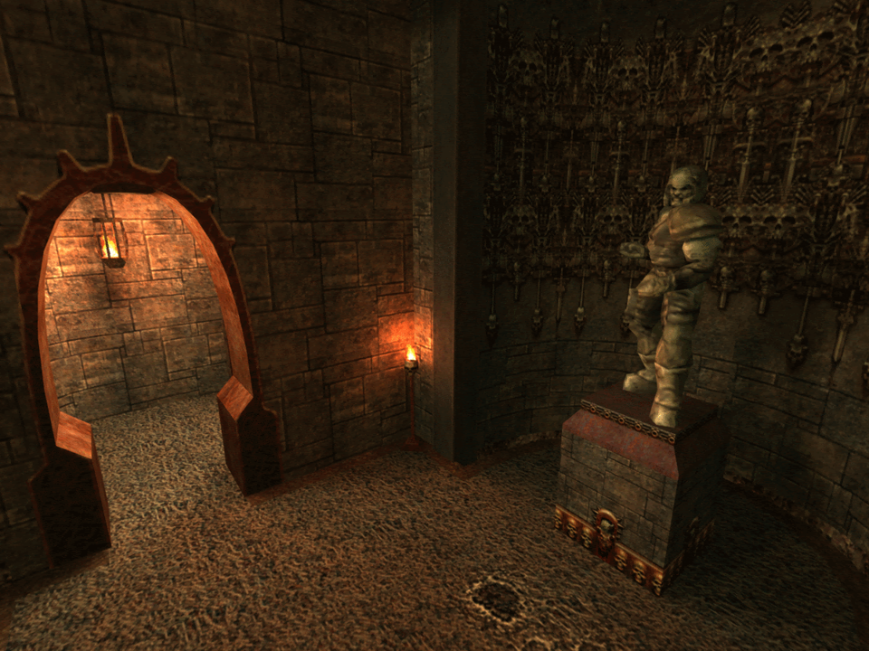
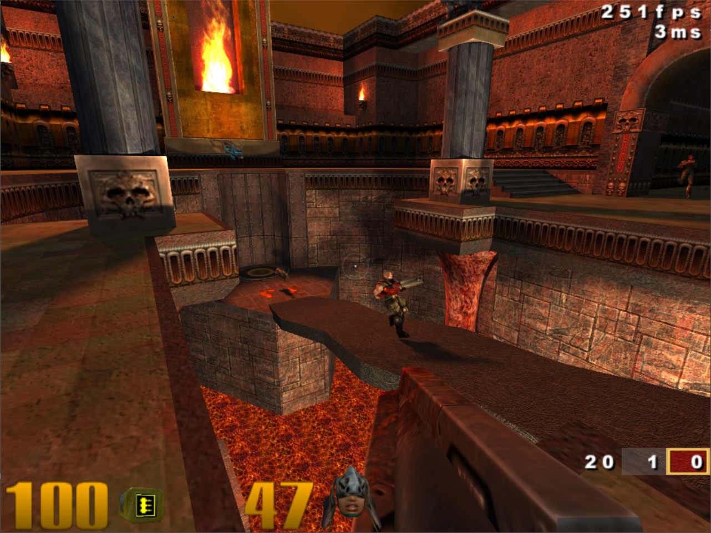
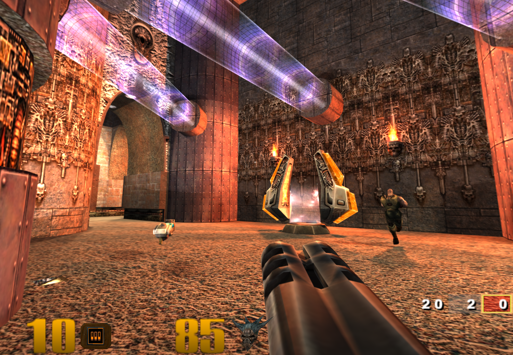
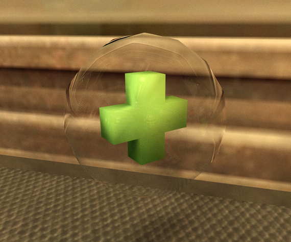
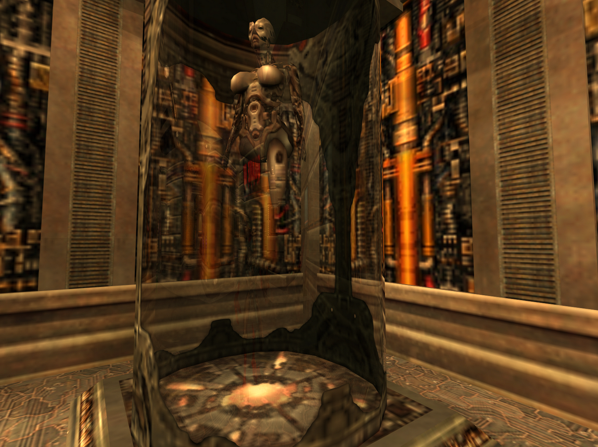

Quake III Arena R
==================================



##### Branches:
`original` : A refactor of the original Quake III source code, to make it compatible with modern computers. Contains cmake files for easy building on win32/linux/macos <br>
`reforged` : A modified version of the original Quake III source code with certain enhancements (e.g. vulkan, rtx).

GENERAL NOTES
=============
##### Command Arguments
Use the following arguments to run Quake III R. Use a `fs_basePath` that fits your Quake III install location.
```bash
+set fs_basePath "C:\GOG Games\Quake III" +set sv_pure 0 +set vm_game 0 +set vm_cgame 0 +set vm_ui 0
```
In order to run the game, blue noise textures are requiered. Copy the folder `blue_noise_textures` into your `"Quake III Arena\baseq3"` folder.
##### Changes:
* `VMI_COMPILED` was removed

##### Requirements:
* [CMake](https://cmake.org/ "CMake") >= 3.14.0

##### Submodules:
Please clone this git with submodules
- [TinyJPEG](https://github.com/serge-rgb/TinyJPEG "TinyJPEG")
- [stb](https://github.com/nothings/stb.git "stb")

COMPILING ON WIN
==================

Use the provided `bat` file to generate a Visual Studio project. In order to run the game, make sure to set `fs_basePath` to a directory containing all the assets. Binarys can be found in `bin/`.

IMAGES
==================


| | |
:-------------------------:|:-------------------------:|
  |   |
  |   |
  |   |

Left: original Quake III; Right: RTX Version.

